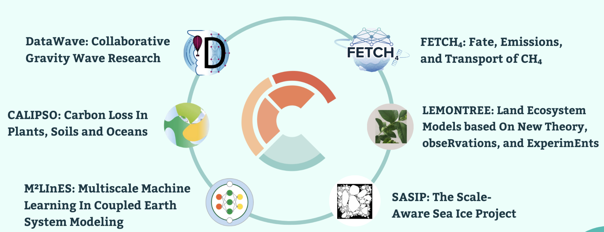

## Collaborations: VESRI and beyond

{fig-align="center" height="20%"}

::: {.columns}
::: {.column width="50%"}

- [DataWave CAM-GW](https://github.com/DataWaveProject/CAM): Neural net parameterizations of gravity waves in CAM
- [MiMA-ML](https://github.com/DataWaveProject/MiMA-machine-learning): Found online behavior diverges from offline for nearly-identical offline gravity waves models. [Mansfield and Sheshadri (2024)](https://doi.org/10.1029/2024MS004292)

:::
::: {.column width="50%"}

- [ICON](https://www.icon-model.org/): ML convection parameterizations work best when causal relations are eliminated. [Heuer et al. (2023)](https://doi.org/10.1029/2024MS004398)
- [GloSea6](https://www.metoffice.gov.uk/research/climate/seasonal-to-decadal/gpc-outlooks/user-guide/global-seasonal-forecasting-system-glosea6): Replaced BiCGStab solver with ML to speed up forecasting. [Park and Chung (2025)](https://doi.org/10.3390/atmos16010060)

:::
:::

The ICCS received support from [Schmidt Sciences](https://www.schmidtsciences.org/)  
This project also received funding from a [C2D3-Accelerate grant](https://science.ai.cam.ac.uk/news/2024-12-09-exploring-novel-applications-of-ai-for-research-and-innovation-%E2%80%93-announcing-our-2024-funded-projects.html)

{.absolute bottom=-4% left=60% width="150" height="auto"}
