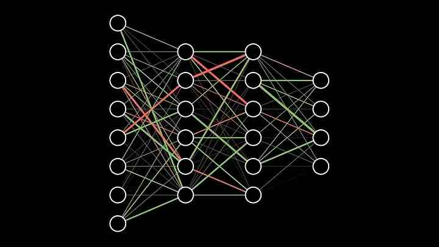

{style="border-radius: 50%;" .absolute bottom=7% left=56% width=25% height=21%}

{ .absolute top=10% left=83% width=27% height=24%}

::: {.attribution}
[Climate components diagram](https://jackatkinson.net/slides/images/Climate_Models.svg) courtesy of Jack Atkinson.

Globe grid with box by Caltech under Fair use.

Neural Net by [3Blue1Brown]( https://www.3blue1brown.com/topics/neural-networks ) under [*fair dealing*](https://www.gov.uk/guidance/exceptions-to-copyright).  
:::

::: {.notes}
 - Climate Models are made of many different components
 - Hybrid approach
     - Subrid scale (ML) parametrization
:::

